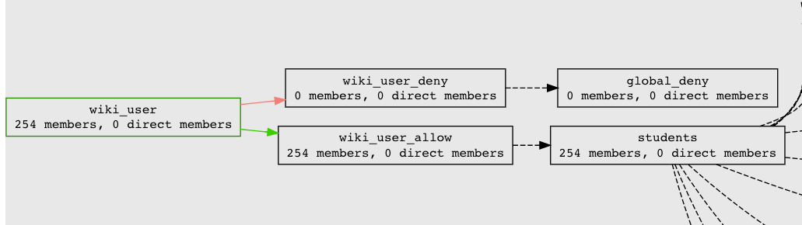

===================================================
201.4 Access Control Model 2 eduPersonEntitlement
===================================================

-------------------
Learning Objectives
-------------------

* Understand ACM2 model and how to implement attribute based access control
* Implement grouper security model
* Configure PSPNG to provision **eduPersonEntitlement** values
* Configure Shibboleth to release **eduPersonEntitlement** values

--------------
Lab Components
--------------

* Grouper
* OpenLDAP
* Shibboleth
* `Grouper Deployment Guide`_
* `eduPerson Object Class Specification`_ 

--------
Overview
--------

`Grouper Deployment Guide`_ access control model 2 (ACM2) is all about
attribute based access control (ABAC) as defined in `NIST SP 800-162`_.  ACM2 is
applicable across a broad range of services where access control policy can be
based on subject attributes, policy decisions can be precomputed, and simple
subject attributes are sufficient to drive the policy enforcement point.

In cases where the SAML Service Provider will accept an
**eduPersonEntitlement** value for enforcing access control, implementing ACM2
can be distilled to these basic steps:

#. Convert the natural language policy into reference and policy groups
#. Provision policy group membership to OpenLDAP via PSPNG
#. Release SP-specfiic **eduPersonEntitlement** values via Shibboleth

---------------------------------------------------
Exercise 201.4.1 Create policy for wiki application
---------------------------------------------------

#. Navigate to the  `app` folder.
#. Create a new `wiki` application using the Application Template
   (More actions -> New template)

[ use new policy template to create wiki_user]
`app:wiki:service:policy:wiki_authorized|allow|deny`.
Edit composite `wiki_authorized` to make it `wiki_allow` minus `wiki_deny`.

---------------------------------------------------
Exercise 201.4.2 Review application security groups
---------------------------------------------------

`app:wiki:security`

.. figure:: ../figures/201-wiki-security.png

-----------------------------------------------
Exercise 201.4.3 Add reference groups to policy
-----------------------------------------------

`wiki_user` is an application-secific role. Subjects in this role have general
access to the wiki. The natural language policy is, "All students have access
to the student wiki, unless they are in the global deny group".

#. Add `ref:student:students` to `app:wiki:service:policy:wiki_allow`.
#. Add `ref:iam:global_deny` to `app:wiki:service:policy:wiki_deny`.
#. Review policy defintion (wiki_user -> More -> Visualization)

-------------------------------------------------------------------------------
Exercise 201.4.4 Configure PSPNG to provision wiki_user to eduPersonEntitlement
-------------------------------------------------------------------------------

#. Assign PSPNG attribute, **provision_to**  to `wiki_user` with a value
   of *pspng_entitlements*.

2. Configure PSPNG to convert membership to ePE value of http://sp.example.org/wiki
   and review in LDAP.  The relevent configuration is below:

   .. literalinclude:: examples/201-4-4.pspng-epe.grouper-loader.properties
        :language: properties
        :caption: grouper-loader.properties
        :linenos:

2. Run CHANGE_LOG_consumer_pspng_entitlements
   (Miscellaneous -> All daemon jobs -> Job actions -> Run job now)

---------------------------------------------------------------
Exercise 201.4.5 Configure Shib to release ePE value for our SP
---------------------------------------------------------------

The demo Shibboleth IdP has been configured to release the
**eduPersonEntitlement** attribute to the demo SP. The relevant configuration
is below:

.. literalinclude:: examples/201-4-5.attribute-filter.xml
    :language: xml
    :caption: attribute-filter.xml
    :lines: 16-42
    :emphasize-lines: 17
    :linenos:

1. Open a new browser to https://localhost:8443/app
2. Log in with username `aclark706` and password `password`
3. Check eduPersonEntitlement value

----------------------------------------------------------------
Exercise 201.4.6 Thought exercise! Create accounts at target SP?
----------------------------------------------------------------
Can we use policy groups to create/manage accounts at target SP?

* Native grouper SP specific provisioning components
* RabbitMQ based provisioning
* midPoint

.. _eduPerson Object Class Specification: http://software.internet2.edu/eduperson/internet2-mace-dir-eduperson-201602.html
.. _Grouper Deployment Guide: https://spaces.at.internet2.edu/display/Grouper/Grouper+Deployment+Guide+Work+-TIER+Program
.. _NIST SP 800-162: https://csrc.nist.gov/publications/detail/sp/800-162/final
