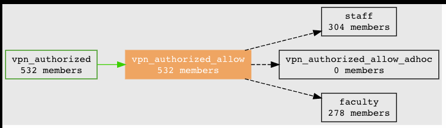

========================
401.1 VPN Access Control
========================

-------------------
Learning Objectives
-------------------

* Use group math and reference groups to analyze legacy authorization groups
* Translate natural language policy into Grouper digital policy
* Implement distributed access management
* Use Grouper to answer access management questions such as "who" and "why"

--------------
Lab Components
--------------

* Grouper
* PSPNG
* OpenLDAP
* `Grouper Deployment Guide`_

--------
Overview
--------

VPN access is currently controlled by an LDAP group. You are not exactly sure
who is in the group or what the policy is, but have a general notion of a
natural language policy as all active faculty and staff, plus some exceptions.
However, people have been added to the VPN ldap group mostly by hand over many
years with little to no lifecycle management in place. There is no easy way to
determine who should or should not be in the group. We just had a major breach
which was facilitated by access to the VPN. The compromised account used in the
breach was given to a former consultant and was never deprovisioned. CISO is
coming down hard on us to clean up our act!

------------------------------------------------------
Exercise 401.1.1 Analyze legacy VPN authoization group
------------------------------------------------------

Gain insight into who exactly has access to the VPN based on the cohorts found
in the legacy VPN authorization group. We'll do this by using well established
reference groups for faculty, staff, and students.

"""""""""""""""""""""""""""""""""""""
Import Legacy VPN authorization group
"""""""""""""""""""""""""""""""""""""

First review the legacy VPN authorization group in LDAP.

#. Log in to https://localhost:8443/phpldapadmin/ with username
   `cn=root,dc=internet2,dc=edu` and password `password`

#. Set the Search Filter to
   "memberOf=cn=vpn_users,ou=groups,dc=internet2,dc=edu"
   and Search Results to 5000. How many subjects are in `vpn_users`?

.. figure:: ../figures/401-legacy-ldap-vpn.png

3. Create a `vpn` folder under the `test` folder
4. Create a `vpn_legacy` group to load the ldap group
5. Added Loader settings to the `vpn_legacy` group
   (vpn_legacy -> More -> Loader -> Loader actions -> Edit loader
   configuration)

* Loader: Yes, has loader configuration
* Source Type: LDAP
* Loader type: LDAP_SIMPLE
* Server ID: demo
* LDAP filter: (cn=vpn_users)
* Subject attribute name: member
* Search base DN: dc=internet2,dc=edu
* Schedule: 0 * * * * ?
* Subject source ID: ldap - EDU Ldap
* Subject lookup type: subjectid
* Search scope: SUBTREE_SCOPE
* Priority:
* Subject expression:${loaderLdapElUtils.convertDnToSpecificValue(subjectId)}
* Require members in other group(s):

6. Run Loader diagnostics (Loader actions -> Loader diagnostics -> Run loader
   diagnostics)

.. figure:: ../figures/401-ldap-loader-diag.png

7. Run loader (Loader actions -> Run loader process to sync group)
8. Review loader logs. How many subject added?
   (Loader actions -> View loader logs)

.. figure:: ../figures/401-ldap-loader-logs.png

9. Review `vpn_legacy` members

.. note::
    The first thing to notice is you can eyeball the types of subjects in the
    Grouper UI. For small groups this might be sufficient, but our VPN group
    has hundreds of subjects.

""""""""""""""""""""""""""""""""""""""""""""""
Use group math to gain insight into vpn_legacy
""""""""""""""""""""""""""""""""""""""""""""""

We will use test composite groups to gain insight into the types of cohorts in
`vpn_legacy` by intersecting it with well known reference groups for faculy,
staff, and student.

1. Create `test:vpn:vpn_faculty` group, and make it a composite intersection of
`ref:faculty` with `test:vpn:vpn_legacy`. This yields faculty count (almost) -
aha! This explains those help desk calls! All faculty should automatically have
access to VPN by policy, but they don't.

2. Create `test:vpn:vpn_staff` group, and make it a composite intersection of
`ref:staff` with `test:vpn:vpn_legacy`. This yields staff count (again
almost!). We're also
missing some staff.

3. Create `test:vpn:vpn_students` group, and make it a composite intersect
`ref:students` with `test:vpn:vpn_legacy`. This yields a small count. As we
expected some students have been added to the vpn access control group as
exceptions, but we don't
know why, when, or by whom.

Hmm, the totals member counts don’t add up...so we have other cohorts too.
Who are they? Set up a composite group to filter out "other cohorts".

4. Create a `test:vpn:other_cohorts` group.

5. Create `vpn_facstaffstudent` and add `vpn_faculty`,
   `vpn_staff`, `vpn_students` as members.

6. Make `other_cohorts` a composite of `vpn_legacy` - `vpn_facstaffstudent`

`Other cohorts` is a relatively small number. We can now eyeball those.

.. figure:: ../figures/401-other-cohorts.png

--------------------------------------------------------------------
Exercise 401.1.2 Translate natural language policy to digital policy
--------------------------------------------------------------------

The natural language policy is "Faculty, staff and exceptions (some students,
contractors, etc.)"

#. Use the application template and the policy group template to create a new
   `vpn` application folder and policy group called `vpn_authorized`

#. Create a new application specific reference group
   `app:vpn:service:ref:vpn_adhoc`.

#. Add `faculty`, `staff`, and `vpn_adhoc` to `vpn_authorized_allow`

#. Compare counts between `vpn_legacy` and `vpn_authorized`.
   `vpn_authorized`. Why are they different?

 
----------------------------------------------------
Exercise 401.1.3 Export `vpn_authorized` to OpenLDAP
----------------------------------------------------

#. Configure `PSPNG`_ to provision group members to OpenLDAP groupOfNames

   .. literalinclude:: examples/401.1.3-pspng-config.properties
        :language: properties
        :lines: 72-
        :caption: /opt/grouper/grouper.apiBinary/conf/grouper-loader.properties
        :name: 401.1.3-pspng-groupofnames
        :linenos:

2. Mark `vpn_authorized` with the PSPNG `provision_to` attribute with a value
of `pspng_groupOfNames`.

3. Run the CHANGLE_LOG_consumer_pspng_groupOfNames
   (Miscellaneous -> All deamon jobs -> Job Actions -> Run job now)

4. Log in to https://localhost:8443/phpldapadmin and navigate to ou=groups.
   Review your new Grouper managed vpn access control group!

.. figure:: ../figures/401-vpn-authorized-ldap.png

5. Open a service ticket to have the network team switch the VPN
   config to use vpn_authorized.

6. Bask in the glow of IAM greatness... :)

* Automatic provisioning/deprovisioning of VPN access for faculty and staff.
* Natural language policy - clear and visible.
* Exceptions management

This is a huge improvement! However, we are still dealing with tickets to
add and remove subjects (well at least to add!) to `vpn_adhoc` group.
There is no way to distinguish different exceptions, and it is not
clear who is responsible for lifecycle and attestation.

------------------------------------------------------------
Exercise 401.1.4 Implement distributed exception management.
------------------------------------------------------------

We initially added exceptions to single application reference group. This a
good step, but we still lack an easy way to know the "who and why" of
exceptions. IAM is still getting tickets to add people. In some case, the
expiration is known and added, but most are a one way street-- back to old
practices. How can we do better?

"""""""""""""""""""""""""""""
Organize Exceptions to Policy
"""""""""""""""""""""""""""""

Each policy exception is represented by an application specific reference
group.

#. Create `app:vpn:ref:vpn_consultants`.  This ACL will be managed by the IAM
   team.
#. Create `app:vpn:ref:vpn_ajohnson409`.  Management of this ACL will be
   delegated to a professor.
#. Add each of these ACLs to `vpn_adhoc`

 
+++++++++++++++++++++++++++++++++++
Professor Johnson's Special Project
+++++++++++++++++++++++++++++++++++

Professor Johnson (**ajohnson409**) runs a special project that includes
various online resources that can only be accessed from the VPN.  The professor
should be able to control who is allowed to have VPN access for the purpose of
accessing his project's resources.

We will create an access control list (ACL) `app:vpn:ref:vpn_ajohnson409` to
represent subjects that will access resources related to Professor Johnson's
special project.  In order to delegate management of this ACL to the professor,
we must create a security group and grant it appropriate permissions:

#. Create `app:vpn:security:vpn_ajohnson409_mgr`.
#. Grant `vpn_ajohnson_mgr` *UPDATE* and *READ* to `vpn_ajohnson409`
#. Add subject `ajohnson409` to this security group.
#. Review the privileges on `vpn_johnson409`

5. In a private browser window, log in to http://localhost:8443/grouper with
   username `ajohnson409` and password `password`. You should be able to add
   and remove members from the `vpn_ajohnson409` ACL.
6. Add student `bsmith458` to `vpn_ajohnson409`
7. Find `bsmith458` in `vpn_authorized` and trace membership

.. figure:: ../figures/401-bsmith458-trace-membership.png

.. figure:: ../figures/401-bsmith458-trace.png

""""""""""""""""""""""
Put Limits on Policies
""""""""""""""""""""""

It is the IAM team's responsibility to make sure that VPN access is granted to
the correct subjects.  Putting some limits in place can help make sure improper
access is not granted.  Attestation makes sure that access which was granted in
the past is still appropriate.

#. Create `ref:iam:global_deny`.  This reference group represents a broad cohort
   of subjects that should not be granted access to most policies.  Subjects
   that fall into this category may be:

   * Termed "with cause"
   * Deceased
   * Other reasons

#. Add `ref:iam:global_deny` to the `app:vpn:vpn_deny` policy.
#. Add attestation requirements to the `app:vpn:ref:vpn_ajohnson409` ACL.

    * Create attestation requirements (30 days).
    * Review notification settings.
    * View :guilabel:`home` -> :guilabel:`misc` -> :guilabel:`attestation settings`.
    * Log in as `ajohnson409` and attest! 
    * View audit log to see who attested group.

#. Add automatic age-off / lifecycle - exceptions only good for 180 days.
   There are 2 techniques:

   * Add member, edit membership, add membership end date.
   * Better approach, use grouper rule to automatically add end date to
     members.  See :ref:`the appendix <apdx-401.1.4-auto-end-date>` for
     details.

#. Use Grouper 2.4 affiliation-based deprovisioning.

All access to VPN is now traceable to natural language policy and known
exceptions! Policy is enforced automatically and kept in sync with changing
subject attributes. Exceptions are known and managed with a defined
attestation lifecycle. VPN policy participates in the global deny policy.

----------------
Exercise 401.1.5
----------------

*CISO is working on a investigation and wants to know if this particular NetID
"blee172" has access to the VPN now or in the past 90 days?*

#. Navigate to `apps:vpn:vpn_authorized`.
#. Search for so-and-so.
#. Open up phpMyAdmin (https://localhost:8443/phpmyadmin/)
#. Open Views, Go to SQL tab, paste in
   :ref:`PIT query <apdx-401.1.5-pit-query>`, Go!

.. _apdx-401.1.5-pit-query:

----------------
Exercise 401.1.6
----------------

*CISO wants to know if anyone on this list of NetIDs has access to the VPN? And
why?*

#. Import list to a test group.
#. Intersect with `vpn_authorized`.
#. Trace membership to determine what level of access and why.

.. _Grouper Deployment Guide: https://spaces.at.internet2.edu/display/Grouper/Grouper+Deployment+Guide+Work+-TIER+Program
.. _`PSPNG`: https://spaces.at.internet2.edu/x/iwfSBQ