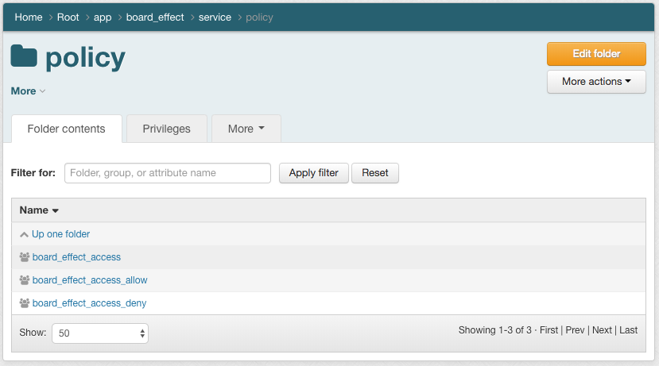
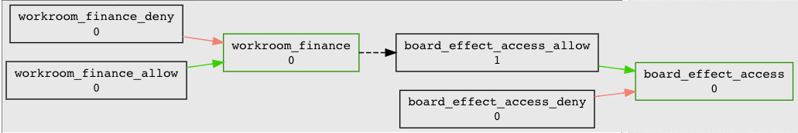
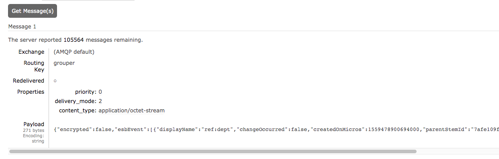
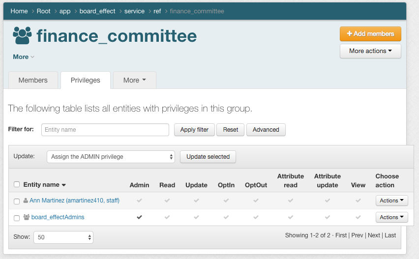
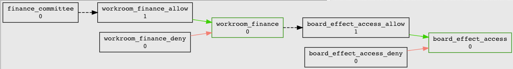
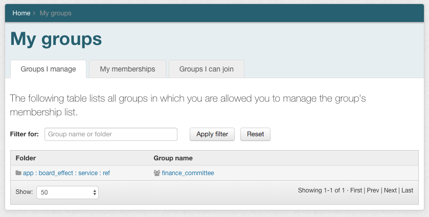

===============================
401.3 Board Effect Provisioning
===============================

-------------------
Learning Objectives
-------------------

--------------
Lab Components
--------------

* Shibboleth IdP
* InCommon Federation
* Grouper
* RabbitMQ
* Grouper ESBChangeLog Consumer
* `Grouper Deployment Guide`_

--------
Overview
--------

We have been asked to deploy a SaaS application called Board Effect. The
service is already an InCommon member and honors an `eduPersonEntitlement`
for "front door" access. Permission management within the application is
centered around "work rooms". Each work room provide access to specific
documents, chat, mailing lists, etc. The system will be used by trustees,
executives, and various committee members.

Thankfully the service is an InCommon member and using `eduPersonEntitlement`
values. However, it turns out users still need to have accounts provisioned
ahead of time in order to get access. We will need two different kinds of
policy groups. The first, the account policy group, will be mapped to an
`eduPersonEntitlement` value and also be used for provisioning accounts. The
second type, authorization groups, will provide subject to role mapping, and
are mapped to work rooms created in Board Effect. This is an example of access
control model 3 described in the `Grouper Deployment Guide`_.

------------------------------------------------------------
Exercise 401.3.1 Create application policy folder and groups
------------------------------------------------------------

#. Use the application template and the policy group template to create a new
   `board_effect` application folder and policy group called
   `board_effect_access`.

---------------------------------------------------
Exercise 401.3.2 Create policy groups for workrooms
---------------------------------------------------

Membership in a Board Effect Workroom provides access to a number of features
and content within Board Effect. A Workroom is essentially an authorization
group. Workroom membership can be updated via a REST API provided by Board
Effect. Grouper policy groups will be mapped to Board Effect workrooms and used
to provision membership updates.

A new workroom call Committee on Finance has been created in Board Effect.
Create an authorization policy group in grouper and configure provisioning.

#. Using the policy template create
   `app:board_effect:service:policy:workroom_finance|allow|deny`.

#. Add `workroom_finance` to `board_effect_access`

----------------------------------------------------
Exercise 401.3.3 Configure the Grouper ESB Connector
----------------------------------------------------

The `Grouper ESB Connector`_ is designed to enable Grouper to interface with an
ESB in order to send and receive individual events as changes occur. We'll use
the ESB Connector to send messages to rabbitMQ for provisioning the workroom
memberships.

#. The following has already been configured for you.

   .. literalinclude:: examples/401.3.2-grouper-loader.properties
        :language: properties
        :lines: 102-118
        :caption: grouper-loader.properties
        :linenos:

   .. literalinclude:: examples/401.3.2-grouper.client.properties
        :language: properties
        :lines: 61-112
        :caption: grouper.client.properties
        :linenos:

2. Write provisioner component to read rabbitMQ and update BoardEffect via REST
   API.

   .. note::

        We will not actually accomplish this step during the lab. Instead, let's
        make sure our messages are making their way to rabbitMQ.

3. Log in to http://localhost:15672/ as username `guest`, password `guest`.
4. Select the `Queues` tab, and then click on the queue named `grouper`
5. Scoll down and click on `Get Message(s)` and review the message.

------------------------------------------------------------------------
Exercise 401.3.4 Configure account provisioning and eduPersonEntitlement
------------------------------------------------------------------------

All access to Board Effect is predicated on the presenence of an
eduPersonEntitlement value, and an account within Board Effect. We will use the
`board_effect_access` policy group to both control the eduPersonEntitlement
value and also provision the account to Board Effect via rabbitMQ.

#. Configure PSPNG to write `eduPersonEntitlement` value
   **https://college.boardeffect.com/** to LDAP. This value will only be
   released via the Shibboleth IdP for the Boardeffect SP. The following is
   already configured for you.

   .. literalinclude:: examples/401.3.2-grouper-loader.properties
        :language: properties
        :lines: 92-100
        :emphasize-lines: 6
        :caption: grouper-loader.properties
        :linenos:

Subject to workroom mapping is now in place and the account and workroom
provisioners are working! But how do we get reference groups for committees?
Ann in President’s Office knows.

-------------------------------------------------------
Exercise 401.3.5 Distributed Reference Group Management
-------------------------------------------------------

Ann currently maintains list of committee members by hand. Instead, she can use
a Grouper reference group.

#. Create `app:board_effect:service:ref:finance_committee`.

#. Give Ann admin access to `app:boardeffect:ref` by adding account
   **amartinez410** to `app:board_effect:security:board_effectAdmins`.

#. Add `finance_committee` to `workroom_finance_allow`.

#. In a private browser, log in as Ann Martinez (username `amartinez410`,
   password `password`). Under *My Groups* you should see the reference groups
   and policies Ann can manage.

#. Add `ksmith3` to the `finance_committee` group.

----------------
Exercise 401.3.6
----------------

*Committee member helpers*

Joe Trustee is on committee, but Joe’s assistant also needs access to
committee work group.

#. Create app specific ref group `app:boardeffect:ref:cmt_fin_helpers`.
#. Add `...:cmt_fin_helpers. to `...:wr_cmt_fin_allow`.

.. note::

    By *not* adding the helper subject to `app:boardeffect:ref:cmt_fin`,
    we preserve the truth of the subject attributes.  Members of `cmt_fin`
    *are* members of the Finance Committee.  The helpers are *not* members
    of the committee, but they *are* granted access to the workroom by
    the policy.

This works great for specific assistants, but there are also general helpers
who need access to all workrooms *temporarily* during board meetings.

#. Create app specific ref group `app:boardeffect:ref:workroom_helpers`.
#. Run :ref:`GSH script <apdx-401.3.5-temp-access>` to add age off rule
   to `workroom_helpers`.
#. Add `workroom_helpers` to all workroom allow groups.

Workrooms created in Boardeffect.  Grouper policy groups map to workroom, and
are kept up to date via Grouper provisioners.  We could create workrooms
automatically based on policy group creation-- exercise left to student at home.

----------------
Exercise 401.3.7
----------------

*Anna's Grouper Privileges*

Anna was added as a direct member of `app:boardeffect:etc:boardeffect_admins`,
but we can do better!  Responsibility for committee member management goes to
the president's executive assistant, whoever that might be.

#. Create a new reference group (role), `ref:roles:president_assistant`
   for president executive assistant.
#. Add Anna's account to `president_assistant`.

This is better, but does Anna really need full admin privileges to
`app:boardeffect`?  Probably only needs update / read.

#. Add `ref:roles:president_assistant` to `app:boardeffect:etc:boardeffect_managers`.
#. Remove Anna from `app:boardeffect:etc:boardeffect_admins`.

----------------
Exercise 401.3.8
----------------

*Global Committee reference groups*

All working great-- new system request comes in with policy based on board
committees.  Need to elevate app-specific ref groups to global ref groups.

#. Create `ref:board` folder for board committee ref groups.
#. Move `app:boardeffect:ref:cmt_fin` to `ref:board:cmt_fin`.

    .. note::

        The Board Effect policies are not impacted by moving the location of
        the reference groups!

#. Create `ref:board:etc` security folder.
#. Create `ref:board:etc:board_managers` security group.
#. Assign *UPDATE* and *READ* rights on reference groups to `board_managers`.
#. Revoke *UPDATE* and *READ* rights of reference groups from `app:board_effect:etc:boardeffect_managers`.

    .. warning::

        Moving our reference groups did *not* remove the access we had granted
        on them from application-specific security groups.  After moving a
        reference group, it is good practive to review its permissions.

#. Add `president_assistant` to `ref:board:etc:board_managers`.

--------
Epilogue
--------

New request comes in for four advisory councils. Each will have their own
workroom in Board Effect.  Initially you are handed a spreadsheet with the
council members and you import them into app-specific reference groups 
(e.g. `app:boardeffect:ref:advisory_council_northeast`).  Later you find
out that council membership is available in Banner, so you create loader
jobs for those.  As it turns out, the spreadsheets were old and had the wrong
members.  Thank goodness for loader jobs!  Alas, not all advisory council
members have NetIDs.  To get them access we add them as sponsored accounts
in COmanage.

The End

.. _Grouper Deployment Guide: https://spaces.at.internet2.edu/display/Grouper/Grouper+Deployment+Guide+Work+-TIER+Program
.. _`Grouper ESB Connector`: https://spaces.at.internet2.edu/display/Grouper/Grouper+ESB+Connector
